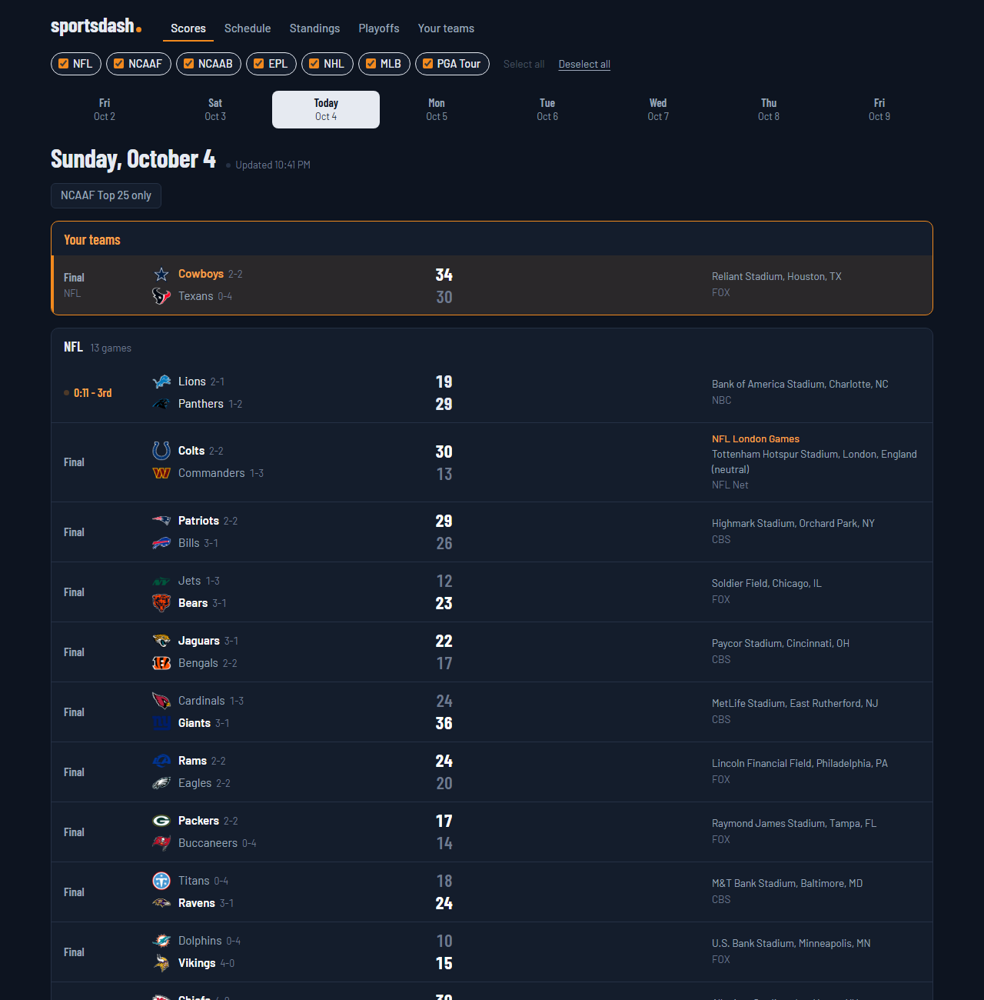
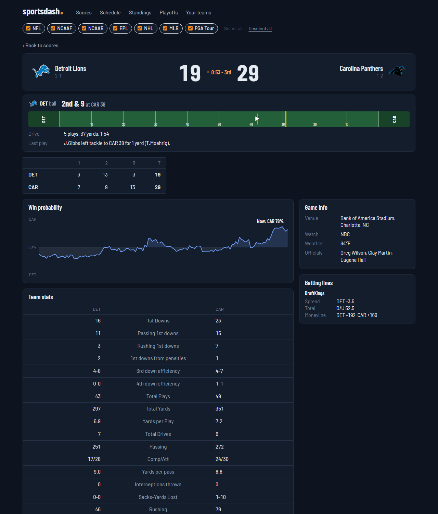
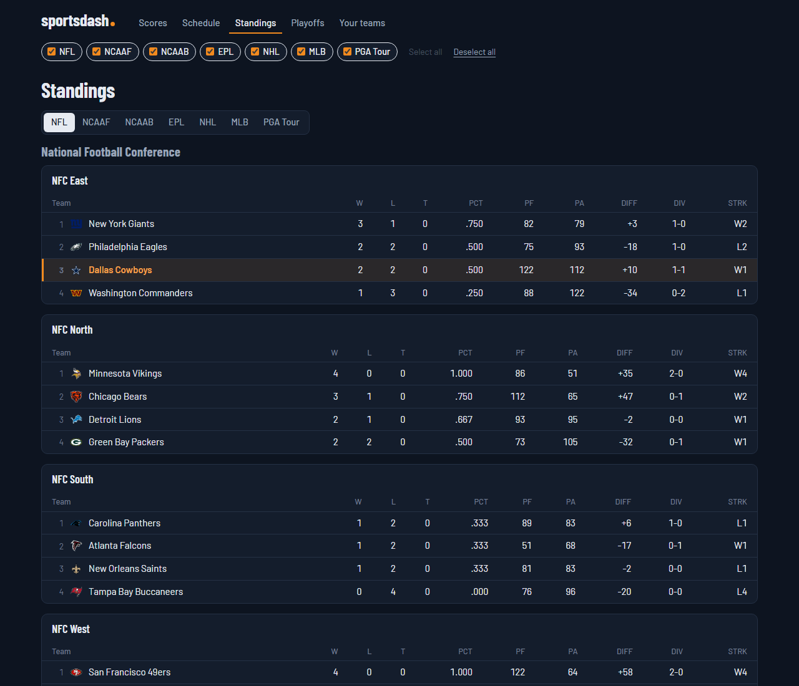
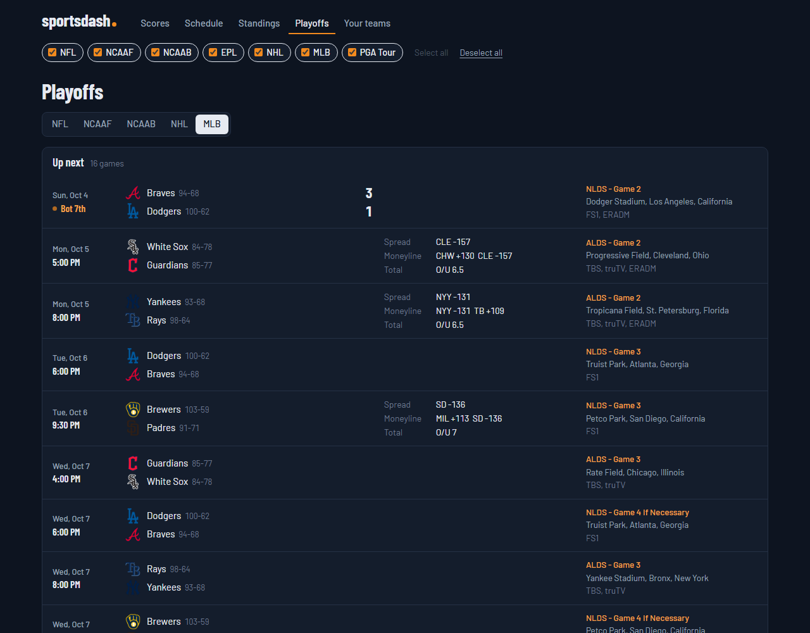
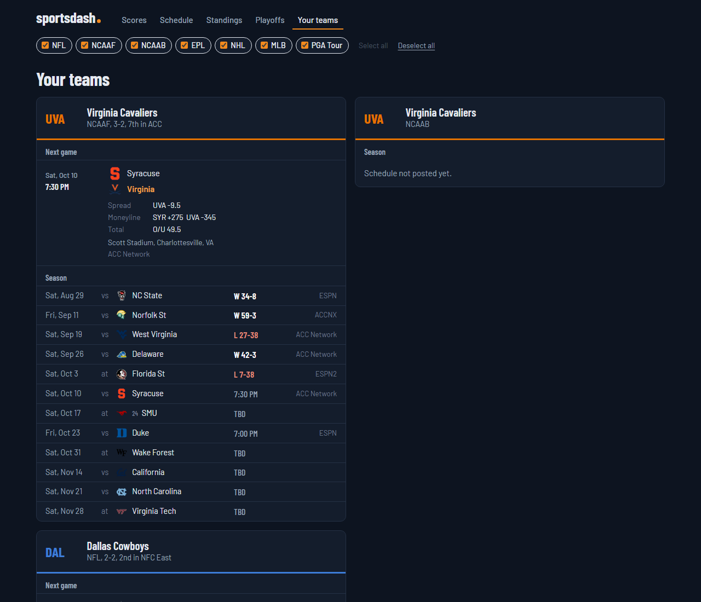

# sportsdash

[](https://vibecoded.fyi/)

A self-hosted scores, schedule and standings dashboard. It runs a React +
TypeScript frontend (Vite) on top of a small Python API (FastAPI).

Out of the box it follows **NFL, NCAAF, NCAAB, EPL, NHL, MLB and the PGA Tour**, with
**Virginia (football + basketball)** and the **Dallas Cowboys** pinned as your teams.
Every game shows its time, venue, TV and betting lines, and each one opens to a
box score.

Data comes from ESPN's public JSON feeds (no API key). They're unofficial and
change without notice; see [ESPN quirks](#espn-quirks).

## Screenshots

**Scores**: your teams pinned on top, then every league, live games first.



**Game**: live down, distance and field position, linescore, win probability,
team and player stats (tabbed by team), game info and betting lines.



<table>
  <tr>
    <td><br><b>Standings</b></td>
    <td><br><b>Playoffs</b></td>
  </tr>
  <tr>
    <td colspan="2"><br><b>Your teams</b></td>
  </tr>
</table>

```
sportsdash/
  config.yaml          leagues and teams (shared by everything)
  backend/             Python: ESPN client, adapters, FastAPI JSON API
  frontend/            React + TypeScript app (Vite)
  Dockerfile           builds both into one image
  docker-compose.yml
```

## Run it on the homelab

```bash
docker compose up -d --build
```

## Develop on Windows

You need Python 3.11+ and Node 20.19+ (Vite 8's minimum; check with `node -v`).
Use two terminals.

**Terminal 1, the API** (http://localhost:8000/api/docs lists every endpoint):

```powershell
cd backend
python -m venv .venv
.venv\Scripts\activate
pip install -r requirements-dev.txt
uvicorn sportsdash.api:app --reload --port 8000
```

**Terminal 2, the React app:**

```powershell
cd frontend
npm install
npm run dev
```

Open **http://localhost:5173**. Vite forwards `/api/...` calls to the backend
(see `vite.config.ts`). Saving any `.tsx` file updates the page instantly
without losing state. That's hot module replacement, and it's most of why React
development feels fast.

**Offline / sample data:** before starting the API, run:

```powershell
$env:SPORTSDASH_FIXTURES="tests/fixtures"; $env:SPORTSDASH_TODAY="2026-10-02"
```

This serves made-up but ESPN-shaped responses from `backend/tests/fixtures/`.

**Checks:**

```powershell
cd backend;  python -m pytest -q          # 38 API + adapter tests
cd frontend; npm test                      # 106 tests: helpers + every page rendered with broken data
cd frontend; npm run build                 # type-check + production build
```

## Troubleshooting

- **Where errors show up.** Python errors and every ESPN request (`ESPN 200  212ms
  football/nfl/scoreboard?...`) print in the backend terminal. Vite's terminal only
  shows build problems. Errors inside React happen in the browser: press **F12** and
  open the **Console** tab.
- **A page shows "This page hit an error while rendering."** Click "Copy error
  details" and paste it somewhere useful. Navigating to another page recovers.
- **ESPN changed something.** Run the checks above, then compare the live feed with
  `backend/tests/fixtures/` (open the ESPN URL from the backend log in a browser).

## Pages

| URL | What's on it |
| --- | --- |
| `/` and `/?date=2026-10-03` | Day strip (two days back, five ahead). Your teams' games pinned at the top, then each league, live games first, then by start time, with ranked matchups first among games at the same time. Auto-refreshes while games can be live. |
| `/?top25=1` | Same, with leagues that have a poll (NCAAF) narrowed to games with a ranked team. Your teams stay pinned. |
| `/schedule?days=7&mine=1` | Next 3 / 7 / 14 days by day, with a "Your teams only" toggle. |
| `/standings?league=nfl` | Division tables under conference headings, your team's conference and division first, your rows highlighted. NCAAF adds the AP Top 25 on top. PGA shows the leaderboard. |
| `/playoffs?league=mlb` | The postseason bracket: one column per round, each series with its games, drawn out to the final with TBD teams for rounds not yet decided. This week's playoff games on top; bowls and other non-bracket games below. Before a league's playoffs start, shows last season's. |
| `/teams` | Each team's next game with lines from every sportsbook, plus its full season. |
| `/team/ncaaf/61` | The same card for any team. Click a team on a game page, in the poll or in standings. |
| `/game/nfl/401772001` | Scoreboard, live situation for football (who has the ball, down and distance, field position, current drive, last play), linescore, win probability, team stats, scoring plays, player stats in a tab per team, game info, betting lines. |
| `/golf/pga/401703510` | Full leaderboard. |

The league chips in the header filter every page and are remembered in the browser.
"Select all" / "Deselect all" next to them flip every league at once.

## Configure leagues and teams

Everything lives in `config.yaml`:

```yaml
leagues:
  - key: nhl                 # anything unique; used in URLs
    name: NHL
    sport: hockey            # ESPN sport slug
    league: nhl              # ESPN league slug
    standings_columns: [GP, W, L, OTL, PTS]

teams:
  - name: Washington Capitals
    short: WSH
    espn_id: "23"            # from the team's ESPN URL: espn.com/nhl/team/_/id/23
    leagues: [nhl]
    color: "#C8102E"
```

Any league ESPN publishes a scoreboard for works without code changes. Find the
slugs by opening `https://site.api.espn.com/apis/site/v2/sports/<sport>/<league>/scoreboard`.
Examples: `basketball/nba`, `baseball/mlb`, `soccer/usa.1` (MLS),
`soccer/uefa.champions`.

`params` adds query parameters to the scoreboard. College feeds need `groups`, or
ESPN returns only ranked games: `80` is all FBS football, `50` is all Division I
basketball.

`rankings` names the ESPN poll used for rank badges, the Top 25 filter and the poll on
Standings: `ap` (AP Top 25), `usa` (Coaches Poll), or `cfp` once the playoff rankings are out.
Add `rankings: ap` to `ncaab` to get the same for basketball.

`standings_params` adds query parameters to the standings request (MLB uses
`{sort: "winpercent:desc"}` because ESPN's default division order is scrambled).
`playoffs: false` hides a league with no postseason on the Playoffs page, and
`playoffs_match` keeps only postseason games whose title contains that text in the bracket
("College Football Playoff" leaves the other bowls in a list below it).
`playoffs_rounds` is the bracket's format (`{Wild Card: 4, Division Series: 4, ...}`): rounds
ESPN hasn't scheduled yet are drawn as TBD matchups so the bracket always reaches the final.

`standings_columns` picks columns by ESPN's stat abbreviation. If none match, the
first ten stats ESPN returns are shown, so a wrong guess still works.

## How the backend works

```
backend/sportsdash/
  config.py        YAML -> typed config
  espn.py          HTTP client with TTL cache; serves stale data if ESPN errors
  adapters/
    parse.py       ESPN JSON -> models (handles scoreboard vs schedule vs summary shapes)
    team_sport.py  NFL / college / soccer: games, schedule, standings, game detail
    golf.py        PGA: calendar, current event, leaderboard
  models.py        dataclasses; the API returns these as JSON
  data.py          cross-league aggregation, fetched in parallel
  api.py           FastAPI routes + serves the built frontend
```

Caching: live days 30 s, future days 10 min, past days and standings 1 h.

## ESPN quirks

- **No date ranges.** Since September 2026 the scoreboard rejects
  `dates=YYYYMMDD-YYYYMMDD` with a 400. sportsdash makes one request per day
  (in parallel, each cached) and merges them.
- **`limit` is capped at 500.** Anything higher silently returns only 25 games.
- Betting lines appear only when ESPN publishes them, usually within a week of
  the game.
- College standings are empty until the season starts (NCAAB until November).
- Standings are requested with `level=3`, which splits conferences into divisions. Leagues
  without divisions (college conferences, EPL) come back the same either way.
- There's no bracket feed. The Playoffs page reads the postseason's dates from the core API
  (`sports.core.api.espn.com/.../seasons/<year>/types/3`), fetches each day's scoreboard,
  and groups postseason games by the round in their notes (`ALDS - Game 2`) and the series
  data ESPN attaches to each game.
- Scoreboard ranks (`curatedRank`) switch from AP to the CFP rankings in November.
  With `rankings: ap`, games after the latest AP poll use AP ranks; older games keep
  the rank each team had at the time.
